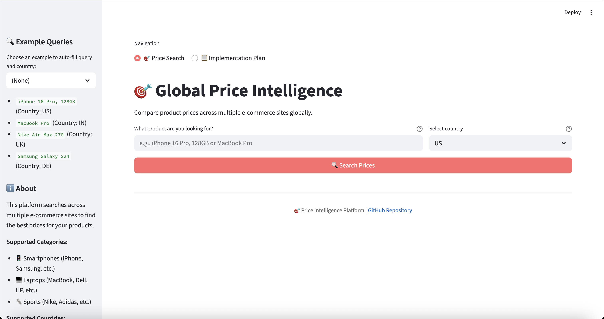
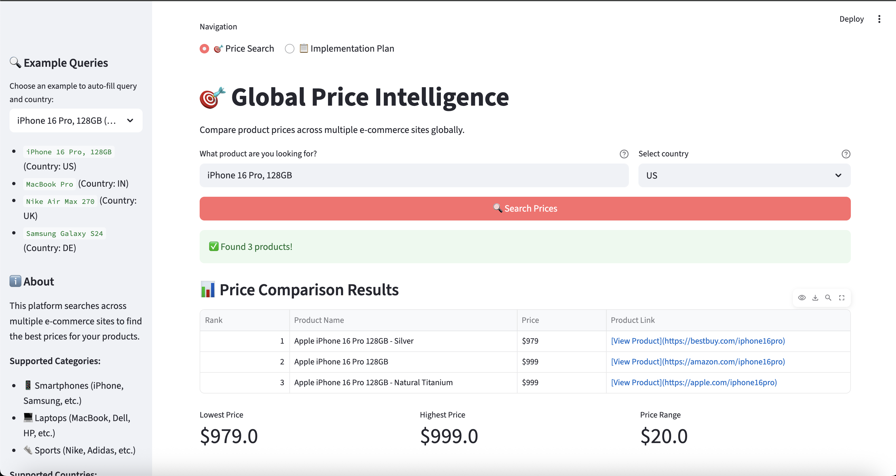
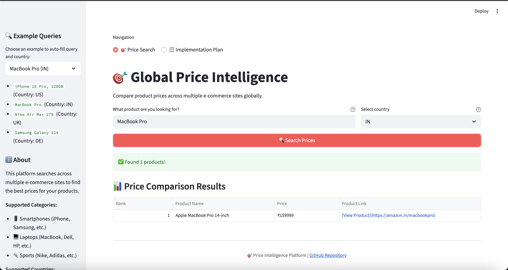
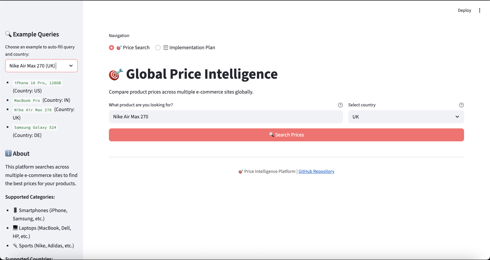
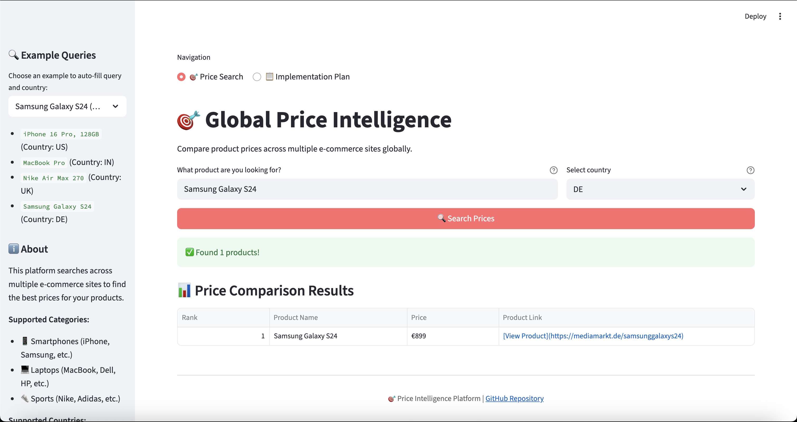
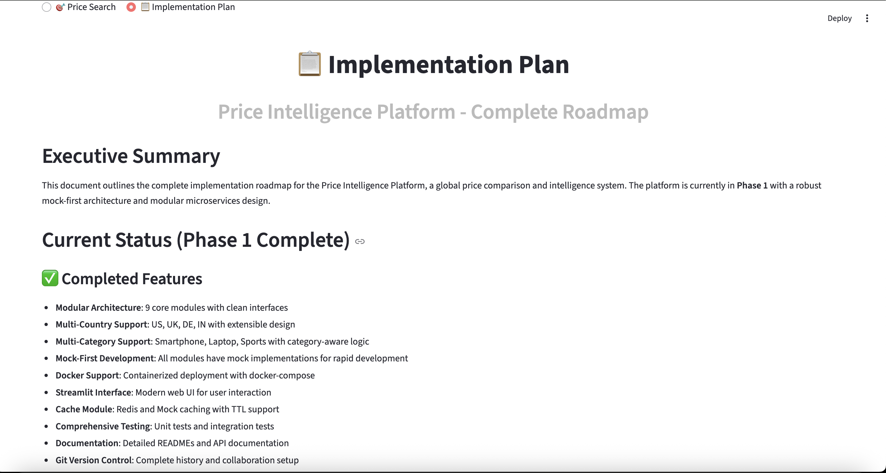

# Price Intelligence Platform

A modular, mock-first Python monorepo for global price intelligence with microservice-like components. This platform provides end-to-end price comparison capabilities across multiple e-commerce sites and countries.

**Note:** Not all sites support all categories in every country. The platform is category-aware and robust to missing data for unsupported (site, category, product) combinations.

## 🌐 Live Demo & Documentation

- **Streamlit App (Price Search):** [https://priceiq.streamlit.app/?page=search](https://priceiq.streamlit.app/?page=search)
- **Streamlit App (Implementation Plan):** [https://priceiq.streamlit.app/?page=plan](https://priceiq.streamlit.app/?page=plan)

---

## 🏗️ Architecture

The platform follows a modular microservice architecture with clear separation of concerns:

```
priceIQ/
├── src/                    # Core modules
│   ├── query_normalizer/   # Normalizes user queries (category-aware)
│   ├── site_selector/      # Selects sites by country & category
│   ├── search_agent/       # Searches product pages (category-aware)
│   ├── scraper/            # Fetches HTML content
│   ├── extractor/          # Extracts product data
│   ├── validator/          # Validates product matches
│   ├── deduplicator/       # Removes duplicate products
│   ├── ranker/             # Ranks by best value
│   └── orchestrator/       # Coordinates the pipeline
├── tests/                 # Organized test suite
├── mocks/                 # Mock data and HTML files
├── config/                # Configuration files
└── main.py                # CLI entry point
```

## 🔧 Module Overview

### 1. Query Normalizer
- **Purpose**: Standardizes and structures user input
- **Input**: Raw query string (e.g., "iPhone 16 Pro, 128GB")
- **Output**: Structured data (brand, model, storage, category)
- **Mock Data**: `mocks/normalized_queries.yaml`

### 2. Site Selector
- **Purpose**: Determines relevant e-commerce sites by country
- **Input**: Country code (e.g., "US")
- **Output**: List of site domains
- **Mock Data**: `mocks/selected_sites.yaml`

### 3. Search Agent
- **Purpose**: Finds product pages on e-commerce sites
- **Input**: Normalized query + site list
- **Output**: Search results with URLs and HTML file paths
- **Mock Data**: `mocks/search_results.yaml`

### 4. Scraper
- **Purpose**: Fetches HTML content from product pages
- **Input**: URLs and HTML file paths
- **Output**: HTML content for extraction
- **Mock Data**: `mocks/html/` directory

### 5. Extractor
- **Purpose**: Parses product information from HTML
- **Input**: HTML content + URL
- **Output**: Structured product data (name, price, currency, link)
- **Mock Data**: `mocks/extracts/` directory

### 6. Validator
- **Purpose**: Ensures extracted data matches the original query
- **Input**: Normalized query + extracted product data
- **Output**: Boolean validation result
- **Mock Data**: `mocks/validated_data.yaml`

### 7. Deduplicator
- **Purpose**: Removes duplicate product entries
- **Input**: List of validated products
- **Output**: Deduplicated product list
- **Mock Data**: `mocks/deduplicated_data.yaml`

### 8. Ranker
- **Purpose**: Sorts products by best value criteria
- **Input**: Deduplicated product list
- **Output**: Ranked product list (best value first)
- **Mock Data**: `mocks/ranked_results.yaml`

### 9. Orchestrator
- **Purpose**: Coordinates the entire pipeline
- **Input**: User input (country, query)
- **Output**: Final ranked product results

### Key Configuration Options:
- **`use_mock`**: Toggle between mock and real implementations
- **`mock_data_path`**: Path to mock data files
- **`sites_by_country`**: E-commerce sites per country
- **`mock_results`**: Predefined mock outputs for testing

## 🌍 Supported Countries & Categories

- **Countries:** US, IN, UK, DE (easily extensible)
- **Categories:** Smartphone, Laptop, Sports (add more by updating config and mock data)
- **Sites:** Only those supporting the category in the country are used

## 🔄 Pipeline Flow

1. **Query Normalization** → Standardize user input (detects category)
2. **Site Selection** → Choose relevant e-commerce sites for country/category
3. **Search Execution** → Find product pages (category-aware)
4. **HTML Fetching** → Retrieve page content
5. **Data Extraction** → Parse product information
6. **Product Validation** → Verify data accuracy
7. **Deduplication** → Remove duplicate entries
8. **Ranking** → Sort by best value

### Phase 1: Enhanced Mock Data(Completed)
- More comprehensive mock scenarios
- Additional countries and sites
- Edge case testing data

## 🔮 Future Enhancements

### Phase 2: Real Implementations
- Web scraping with Playwright/Selenium
- API integrations for e-commerce sites
- LLM-based query normalization
- Machine learning for ranking

### Phase 3: Advanced Features
- Real-time price monitoring
- Price history tracking
- User preference learning
- Multi-language support

## 🚀 Quick Start

### Option 1: Docker (Recommended)

The easiest way to run the platform without any setup issues:

#### Prerequisites
- Docker and Docker Compose installed

#### Quick Start with Docker
```bash
# Clone the repository
git clone <repository-url>
cd priceIQ

# Build and run with Docker Compose
docker-compose up --build

# Access Streamlit frontend at: http://localhost:8501
```

#### Docker Commands

**Start Streamlit frontend:**
```bash
docker-compose up streamlit
```

**Run CLI commands:**
```bash
# Execute CLI in running container
docker-compose exec cli python3 main.py --query "iPhone 16 Pro" --country "US"

# Or run a new container for CLI
docker run --rm -v $(pwd):/app priceiq python3 main.py --query "MacBook Pro" --country "IN"
```

**Build and run manually:**
```bash
# Build the image
docker build -t priceiq .

# Run Streamlit
docker run -p 8501:8501 -v $(pwd):/app priceiq

# Run CLI
docker run --rm -v $(pwd):/app priceiq python3 main.py --query "Nike Air Max 270" --country "UK"
```

**Complete Docker Workflow:**
```bash
# 1. Build and start all services
docker-compose up --build -d

# 2. Check service status
docker-compose ps

# 3. View logs
docker-compose logs streamlit
docker-compose logs cli

# 4. Test CLI functionality
docker-compose exec cli python3 main.py --query "iPhone 16 Pro" --country "US"
docker-compose exec cli python3 main.py --query "MacBook Pro" --country "IN"
docker-compose exec cli python3 main.py --query "Nike Air Max 270" --country "UK"
docker-compose exec cli python3 main.py --query "Samsung Galaxy S24" --country "DE"

# 5. Access Streamlit interface
# Open http://localhost:8501 in browser

# 6. Stop all services
docker-compose down

# 7. Clean up (optional)
docker-compose down --volumes --remove-orphans
docker system prune -f
```

**Individual Docker Commands:**
```bash
# Build image only
docker build -t priceiq .

# Run Streamlit with custom port
docker run -p 8502:8501 priceiq

# Run CLI with specific query
docker run --rm priceiq python3 main.py --query "iPhone 16 Pro" --country "US"

# Run CLI with JSON input file
docker run --rm -v $(pwd):/app priceiq python3 main.py --input_file sample_input.json

# Interactive shell in container
docker run -it --rm priceiq /bin/bash

# View container logs
docker logs <container_name>

# Stop specific service
docker-compose stop streamlit
docker-compose stop cli

# Restart services
docker-compose restart

# Rebuild and restart
docker-compose up --build --force-recreate
```

**Development Commands:**
```bash
# Start development mode with volume mounting
docker-compose up -d

# Make code changes (automatically reflected via volume mounting)

# Test changes immediately
docker-compose exec cli python3 main.py --query "iPhone 16 Pro" --country "US"

# View real-time logs
docker-compose logs -f streamlit
docker-compose logs -f cli

# Rebuild after dependency changes
docker-compose build --no-cache
docker-compose up -d
```

**Troubleshooting Commands:**
```bash
# Check container status
docker-compose ps

# View detailed logs
docker-compose logs --tail=100 streamlit

# Access container shell
docker-compose exec cli /bin/bash
docker-compose exec streamlit /bin/bash

# Check container resources
docker stats

# Clean up everything
docker-compose down --volumes --remove-orphans
docker system prune -a -f
```

### Option 2: Local Installation

#### Prerequisites
- Python 3.8+
- pip

#### Installation
```bash
git clone <repository-url>
cd priceIQ
pip install -r requirements.txt
```

#### Basic Usage

**Using the CLI directly:**
```bash
# Query with direct arguments
python3 main.py --query "Nike Air Max 270" --country "US"
python3 main.py --query "MacBook Pro" --country "IN"

# Query with JSON file
python3 main.py --input_file sample_input.json
```

**Using the convenience script:**
```bash
chmod +x run.sh
./run.sh "Nike Air Max 270" "US"
```

**Using Streamlit frontend:**
```bash
streamlit run streamlit_app.py
```

## 📸 Application Screenshots

### Main Interface


### Search Results Examples





### Documentation


## 🧩 Category-Aware Flow

- **Query Normalizer** returns category-specific attributes based on product type
- **Site selection** and **search agent** are category-aware: only sites that support the product category in the given country are used.
- Not all sites return results for all products/categories/countries.
- Missing data for a (site, category, product) is expected and handled gracefully.

### Category-Specific Attributes

The query normalizer returns different attributes based on the detected product category:

#### Smartphone Attributes
```json
{
  "brand": "Apple",
  "model": "iPhone 16 Pro", 
  "storage": "128GB",
  "color": "Natural Titanium",
  "screen_size": "6.1 inch",
  "category": "Smartphone"
}
```

#### Laptop Attributes
```json
{
  "brand": "Apple",
  "model": "MacBook Pro",
  "storage": "512GB", 
  "ram": "16GB",
  "screen_size": "14 inch",
  "processor": "M3 Pro",
  "category": "Laptop"
}
```

#### Sports Attributes
```json
{
  "brand": "Nike",
  "model": "Air Max 270",
  "size": "US 10",
  "color": "Black/White", 
  "type": "Running Shoes",
  "category": "Sports"
}
```

### Example: Sports Category in US
```python
# User query: "Nike Air Max 270" (category: Sports)
# Country: US
# Selected sites: ["amazon.com", "bestbuy.com", "nike.com"]
# Only these sites will be searched for this product/category/country.
```

### Example: Laptop Category in India
```python
# User query: "MacBook Pro" (category: Laptop)
# Country: IN
# Selected sites: ["amazon.in", "flipkart.com", "croma.com", "reliancedigital.in"]
```

## 📋 Sample Output

### Example 1: iPhone 16 Pro (US)
```bash
python3 main.py --query "iPhone 16 Pro" --country "US"
```
```json
[
  {
    "productName": "Apple iPhone 16 Pro 128GB - Silver",
    "price": "979",
    "currency": "USD",
    "link": "https://bestbuy.com/iphone16pro"
  },
  {
    "productName": "Apple iPhone 16 Pro 128GB",
    "price": "999",
    "currency": "USD",
    "link": "https://amazon.com/iphone16pro"
  },
  {
    "productName": "Apple iPhone 16 Pro 128GB - Natural Titanium",
    "price": "999",
    "currency": "USD",
    "link": "https://apple.com/iphone16pro"
  }
]
```

### Example 2: MacBook Pro (India)
```bash
python3 main.py --query "MacBook Pro" --country "IN"
```
```json
[
  {
    "productName": "Apple MacBook Pro 14-inch",
    "price": "159999",
    "currency": "INR",
    "link": "https://amazon.in/macbookpro"
  }
]
```

### Example 3: Nike Air Max 270 (UK)
```bash
python3 main.py --query "Nike Air Max 270" --country "UK"
```
```json
[
  {
    "productName": "Nike Air Max 270",
    "price": "120",
    "currency": "GBP",
    "link": "https://sportsdirect.com/nikeairmax270"
  },
  {
    "productName": "Nike Air Max 270 - Black",
    "price": "120",
    "currency": "GBP",
    "link": "https://sportsdirect.com/nikeairmax270-black"
  },
  {
    "productName": "Nike Air Max 270",
    "price": "130",
    "currency": "GBP",
    "link": "https://jdsports.co.uk/nikeairmax270"
  },
  {
    "productName": "Nike Air Max 270 - White",
    "price": "130",
    "currency": "GBP",
    "link": "https://jdsports.co.uk/nikeairmax270-white"
  }
]
```

### Example 4: Samsung Galaxy S24 (Germany)
```bash
python3 main.py --query "Samsung Galaxy S24" --country "DE"
```
```json
[
  {
    "productName": "Samsung Galaxy S24",
    "price": "899",
    "currency": "EUR",
    "link": "https://mediamarkt.de/samsunggalaxys24"
  }
]
```

### Docker Examples:
```bash
# All examples work in Docker containers
docker run --rm priceiq python3 main.py --query "iPhone 16 Pro" --country "US"
docker run --rm priceiq python3 main.py --query "MacBook Pro" --country "IN"
docker run --rm priceiq python3 main.py --query "Nike Air Max 270" --country "UK"
docker run --rm priceiq python3 main.py --query "Samsung Galaxy S24" --country "DE"

# Or with docker-compose
docker-compose exec cli python3 main.py --query "iPhone 16 Pro" --country "US"
```

## 🐳 Docker Support

The platform includes comprehensive Docker support for easy deployment and development:

### Docker Architecture
- **Base Image**: Python 3.10-slim for lightweight containers
- **Multi-service**: Separate containers for Streamlit frontend and CLI backend
- **Volume Mounting**: Live code changes without rebuilding
- **Port Mapping**: Streamlit accessible on localhost:8501

### Docker Services

#### Streamlit Service
- **Purpose**: Web-based user interface
- **Port**: 8501
- **Features**: Real-time price comparison with country selection
- **Access**: http://localhost:8501

#### CLI Service
- **Purpose**: Command-line interface for testing and automation
- **Features**: Full pipeline access, batch processing
- **Usage**: Execute commands in running container

### Docker Development Workflow

```bash
# 1. Start development environment
docker-compose up -d

# 2. Make code changes (automatically reflected via volume mounting)

# 3. Test CLI functionality
docker-compose exec cli python3 main.py --query "iPhone 16 Pro" --country "US"

# 4. Access Streamlit interface
# Open http://localhost:8501 in browser

# 5. Stop services
docker-compose down
```

### Production Deployment

```bash
# Build optimized production image
docker build -t priceiq:latest .

# Run in production mode
docker run -d -p 8501:8501 --name priceiq-app priceiq:latest
```

## 🚀 Quick Reference

### Essential Commands
```bash
# Local Development
python3 main.py --query "iPhone 16 Pro" --country "US"
streamlit run streamlit_app.py

# Docker Development
docker-compose up --build
docker-compose exec cli python3 main.py --query "iPhone 16 Pro" --country "US"

# Production
docker build -t priceiq .
docker run -p 8501:8501 priceiq
```

### Working Examples
```bash
# All these queries return ranked results:
python3 main.py --query "iPhone 16 Pro" --country "US"
python3 main.py --query "MacBook Pro" --country "IN"
python3 main.py --query "Nike Air Max 270" --country "UK"
python3 main.py --query "Samsung Galaxy S24" --country "DE"
```

### Access Points
- **Streamlit UI**: http://localhost:8501
- **CLI**: `python3 main.py --query "<product>" --country "<country>"`
- **Docker CLI**: `docker-compose exec cli python3 main.py --query "<product>" --country "<country>"`

### Supported Countries & Categories
- **US**: Smartphone, Laptop, Sports
- **IN**: Smartphone, Laptop, Sports  
- **UK**: Smartphone, Laptop, Sports
- **DE**: Smartphone, Laptop, Sports
- **Integration**: Calls all modules in sequence

## 🧪 Testing

### Test Structure
```
tests/
├── query_normalizer/
├── site_selector/
├── search_agent/
├── scraper/
├── extractor/
├── validator/
├── deduplicator/
├── ranker/
├── orchestrator/
└── run_all_tests.py
```

### Running Tests

#### Individual Module Tests:
```bash
python3 tests/query_normalizer/test_query_normalizer.py
python3 tests/orchestrator/test_orchestrator.py
```

#### All Tests:
```bash
python3 tests/run_all_tests.py
```

#### Using Make:
```bash
make test
```

### Test Coverage
- **Unit Tests**: Each module has comprehensive unit tests
- **Integration Tests**: End-to-end pipeline testing
- **Mock Validation**: Config integrity and mock data validation
- **Error Handling**: Edge cases and error scenarios
- **Multi-Country**: Tests for different country configurations

## ⚙️ Configuration

### Main Config File: `config/phase1_config.yaml`

```yaml
site_selector:
  use_mock: true
  sites_by_country_and_category:
    US:
      Smartphone:
        - amazon.com
        - bestbuy.com
        - apple.com
      Laptop:
        - amazon.com
        - bestbuy.com
        - apple.com
      Sports:
        - amazon.com
        - bestbuy.com
        - nike.com
    IN:
      Smartphone:
        - amazon.in
        - flipkart.com
        - croma.com
        - reliancedigital.in
      Laptop:
        - amazon.in
        - flipkart.com
        - croma.com
        - reliancedigital.in
      Sports:
        - amazon.in
        - flipkart.com
        - paytmmall.com
        - snapdeal.com
    # ... other countries
search_agent:
  use_mock: true
  mock_results:
    amazon.com:
      Smartphone:
        - url: https://amazon.com/iphone16pro
          html_file: mocks/html/amazon_iphone16pro.html
      Laptop:
        - url: https://amazon.com/macbookpro
          html_file: mocks/html/amazon_macbookpro.html
      Sports:
        - url: https://amazon.com/nikeairmax
          html_file: mocks/html/amazon_nikeairmax.html
    nike.com:
      Sports:
        - url: https://nike.com/airmax270
          html_file: mocks/html/nike_airmax270.html
    # ...
```

## 🚀 Development

### Adding New Modules
1. Create module directory in `src/`
2. Implement `interface.py` with main class
3. Add mock data configuration
4. Create test file in `tests/<module_name>/`
5. Update orchestrator to include new module

### Adding New Countries
1. Update `config/phase1_config.yaml` with country sites
2. Add mock HTML files in `mocks/html/`
3. Update mock data files as needed
4. Test with new country code

### Mock-First Development
- All modules start with mock implementations
- Real implementations raise `NotImplementedError`
- Mock data provides consistent test results
- Easy to extend with real implementations later

## 📁 Project Structure

```
priceIQ/
├── main.py                    # CLI entry point
├── run.sh                     # Convenience script
├── Makefile                   # Build automation
├── requirements.txt           # Dependencies
├── sample_input.json          # Sample input file
├── src/                       # Source code
│   ├── query_normalizer/
│   ├── site_selector/
│   ├── search_agent/
│   ├── scraper/
│   ├── extractor/
│   ├── validator/
│   ├── deduplicator/
│   ├── ranker/
│   └── orchestrator/
├── tests/                     # Test suite
│   ├── query_normalizer/
│   ├── site_selector/
│   ├── search_agent/
│   ├── scraper/
│   ├── extractor/
│   ├── validator/
│   ├── deduplicator/
│   ├── ranker/
│   ├── orchestrator/
│   └── run_all_tests.py
├── mocks/                     # Mock data
│   ├── html/                  # Mock HTML files
│   ├── normalized_queries.yaml
│   ├── selected_sites.yaml
│   ├── search_results.yaml
│   ├── extracts/
│   ├── validated_data.yaml
│   ├── deduplicated_data.yaml
│   └── ranked_results.yaml
└── config/                    # Configuration
    └── phase1_config.yaml
```

## 🤝 Contributing

1. Fork the repository
2. Create a feature branch
3. Add tests for new functionality
4. Ensure all tests pass
5. Submit a pull request

## 📄 License

[Add your license information here]

## 🆘 Support

For questions or issues:
1. Check the test suite for usage examples
2. Review the configuration files
3. Run `make test` to verify setup
4. Create an issue with detailed description

**Built with ❤️ for global price intelligence** 
